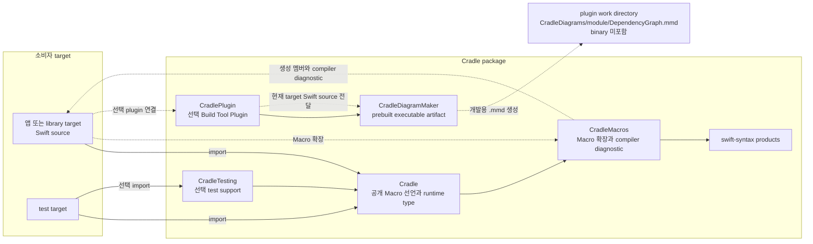
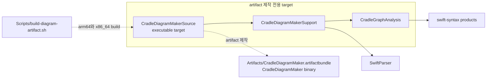

# Cradle 아키텍처

Cradle은 compiler가 graph 선언을 확장하는 경로와 build 중 Mermaid를 만드는 경로를 나눠요. 둘 다 소비자 Swift source를 보지만, 서로의 결과를 사용하지 않아요.

## 소비자 build 흐름

아래 그림의 실선은 package target 의존성이에요. 점선은 compiler 확장, plugin 실행, 개발용 산출물 생성처럼 build 중에만 일어나는 흐름이에요.

소비자 target은 `Cradle`만 import해요. `CradleMacros`는 `Cradle`이 참조하는 Macro 구현 target이므로 소비자가 직접 의존하거나 import하지 않아요. Macro는 `@DependencyGraph`와 `@Provide`를 확장하고, graph 연결이 성립하지 않는 경우 compiler diagnostic을 만들어요.

`CradleTesting`은 test target에서만 선택해요. `CradlePlugin`도 별도 경로예요. plugin은 현재 target의 Swift source를 `CradleDiagramMaker`에 전달해 `.mmd`를 만들 뿐, app이나 library binary에 연결하지 않아요.

## artifact 제작 경로

소비자 build는 prebuilt `CradleDiagramMaker`를 사용해요. 아래 target들은 그 artifact를 제작하고 검증할 때만 쓰며, 소비자 target의 의존성이 아니에요.

`CradleDiagramMakerSource`는 `CradleDiagramMakerSupport`와 `CradleGraphAnalysis`로 source의 선언을 읽어요. `Scripts/build-diagram-artifact.sh`는 arm64와 x86_64 실행 파일을 만들어 artifact에 넣어요. 소비자 build에서는 이 artifact만 `CradlePlugin`이 실행해요.

Mermaid 분석은 Macro 확장과 별개예요. 따라서 이 문서는 runtime override 선택, graph 수명, `@External` 호출 경로를 설명하지 않아요. 그 계약은 [DependencyGraph 안내](../Sources/Cradle/Cradle.docc/DependencyGraph.md)에서 확인할 수 있어요.
